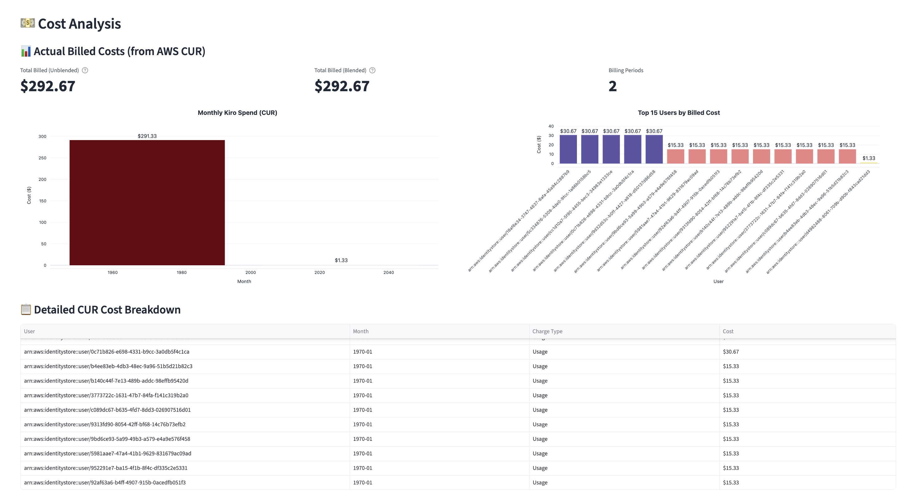
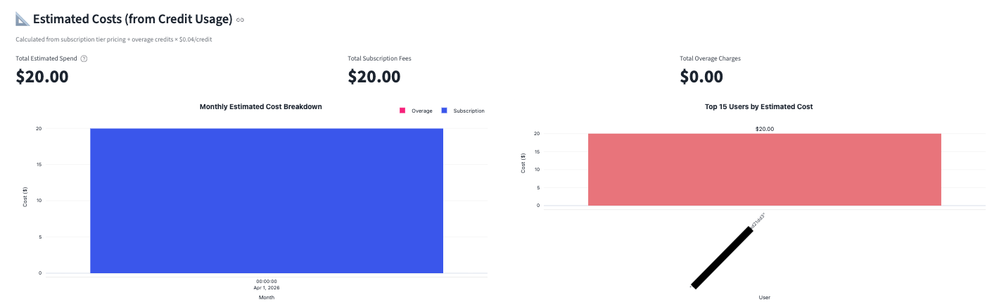
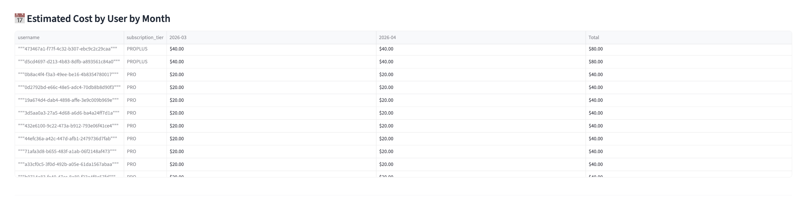

# 💵 CUR Integration Setup Guide

This guide covers how to set up AWS Cost and Usage Report (CUR 2.0) data exports with resource IDs so the Kiro dashboard can show actual billed dollar amounts per user.

## Why CUR?

The Kiro user report gives you credit usage, but not dollar amounts. CUR data from AWS Billing provides the actual invoiced costs, including subscription fees and overage charges, broken down by resource ID (which maps to Kiro user IDs).

## Which scenario are you in?

| Scenario | What to do |
|---|---|
| **No CUR export exists** | [Option A: Create a new CUR 2.0 export](#option-a-create-a-new-cur-20-export) |
| **CUR 2.0 export exists WITHOUT resource IDs** | [Option B: Create an additional export](#option-b-existing-cur-20-without-resource-ids) |
| **Legacy CUR export exists WITHOUT resource IDs** | [Option C: Create a CUR 2.0 export alongside legacy](#option-c-legacy-cur-without-resource-ids) |
| **CUR export already has resource IDs** | [Skip to: Connect to the dashboard](#connect-cur-to-the-dashboard) |

> **Key constraint:** `INCLUDE_RESOURCES` cannot be changed after a CUR 2.0 export is created. If your existing export doesn't include resource IDs, you must create a new one.

---

## Option A: Create a new CUR 2.0 export

Use this if you don't have any CUR export yet.

1. Open [AWS Billing → Data Exports](https://console.aws.amazon.com/costmanagement/home#/bcm-data-exports)
2. Choose **Create**
3. Select **Standard data export**
4. Give it a name (e.g. `kiro-cur2-with-resources`)
5. Select the **CUR 2.0** table — all columns are selected by default
6. Under **Data table configurations**:
   - Time granularity: **DAILY**
   - Include resource IDs: ✅ **checked**
7. Under **Data export delivery options**:
   - Compression type and file format: **Parquet**
   - Report versioning: **Overwrite existing report** (saves S3 costs)
8. Under **Data export storage settings**:
   - Choose or create an S3 bucket
   - Set an S3 path prefix (e.g. `cur-reports`)
9. Choose **Create**

---

## Option B: Existing CUR 2.0 without resource IDs

`INCLUDE_RESOURCES` cannot be modified on an existing export. You need to create a second export.

### Step 1: Check your current export

1. Open [AWS Billing → Data Exports](https://console.aws.amazon.com/costmanagement/home#/bcm-data-exports)
2. Click on your existing export name
3. Under **Data table configurations**, check if **Include resource IDs** is enabled
4. If it's not enabled, proceed to Step 2

### Step 2: Create a new export with resource IDs

Your existing export won't be affected. Follow the same steps as [Option A](#option-a-create-a-new-cur-20-export), using a different name and S3 prefix (e.g. `cur-kiro`) to keep it separate.

### Step 3 (optional): Delete the old export

If you no longer need the export without resource IDs:

1. Open [AWS Billing → Data Exports](https://console.aws.amazon.com/costmanagement/home#/bcm-data-exports)
2. Select the old export
3. Choose **Delete**

---

## Option C: Legacy CUR without resource IDs

If you're on the legacy CUR and it doesn't include resource IDs, create a CUR 2.0 export alongside it. They don't interfere with each other, and CUR 2.0 gives you a consistent schema with SQL query support.

Follow the steps in [Option A](#option-a-create-a-new-cur-20-export).

---

## Connect CUR to the dashboard

Once your CUR export is delivering data to S3:

### 1. Update terraform.tfvars

```hcl
# Point to your CUR S3 bucket and prefix
cur_s3_bucket_name = "YOUR-BUCKET-NAME/cur-reports"
```

### 2. Re-deploy

```bash
./deploy.sh
```

This will:
- Create a Glue database and crawler for the CUR data
- Run the crawler to catalog the Parquet files
- Add `CUR_DATABASE` and `CUR_ENABLED=true` to `app/.env`

### 3. Verify

The dashboard will now show a **💵 Cost Analysis** section with:
- Actual billed costs from CUR (unblended and blended)
- Monthly Kiro spend trend
- Per-user cost breakdown
- Detailed charge type table (subscription vs overage line items)
- Estimated costs from credit usage (always available as a fallback)


*CUR-based actual billed costs with monthly trend and per-user breakdown*


*Estimated costs calculated from credit usage (subscription fees + overage)*


*Per-user monthly cost breakdown table*

> **Note:** Screenshots are placeholders — replace with actual dashboard captures after deployment.

---

## S3 Bucket Policy

AWS needs permission to deliver CUR data to your S3 bucket. When creating the export via the console, AWS will prompt you to verify or update the bucket policy automatically. If you're using an existing bucket and the export fails to deliver, add this policy:

```json
{
  "Version": "2012-10-17",
  "Statement": [
    {
      "Effect": "Allow",
      "Principal": {
        "Service": "bcm-data-exports.amazonaws.com"
      },
      "Action": [
        "s3:PutObject",
        "s3:GetBucketPolicy"
      ],
      "Resource": [
        "arn:aws:s3:::YOUR-BUCKET-NAME",
        "arn:aws:s3:::YOUR-BUCKET-NAME/*"
      ],
      "Condition": {
        "StringEquals": {
          "aws:SourceAccount": "YOUR-ACCOUNT-ID"
        }
      }
    }
  ]
}
```

---

## Data availability

- New CUR exports typically take up to 24 hours to deliver the first dataset
- Data refreshes up to 3 times daily
- Historical data: CUR 2.0 exports include data from the current month onward (not retroactive)
- For historical cost data, check AWS Cost Explorer in the console

## Troubleshooting

### Export not delivering data

- Verify the S3 bucket policy allows the `bcm-data-exports.amazonaws.com` service to write
- Check that the export status shows **Active** in the Data Exports console
- New exports can take up to 24 hours for the first delivery

### No Kiro line items in CUR

- Kiro charges appear under `line_item_product_code = 'Kiro'`
- If you just subscribed, charges will appear in the next billing period
- Ensure the export covers the correct billing period

### Dashboard shows "No CUR table found"

- Run the Glue crawler manually from the AWS Glue console
- Verify the CUR Parquet files exist in the S3 path you configured

## References

- [AWS Data Exports - Creating exports](https://docs.aws.amazon.com/cur/latest/userguide/dataexports-create.html)
- [CUR 2.0 table dictionary](https://docs.aws.amazon.com/cur/latest/userguide/table-dictionary-cur2.html)
- [Migrating from legacy CUR to CUR 2.0](https://docs.aws.amazon.com/cur/latest/userguide/dataexports-migrate.html)
